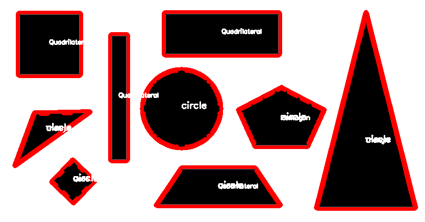

# Optional Assignment 1

The code on which optional assignment 1 is based was obtained from 
[geeksforgeeks.org](https://www.geeksforgeeks.org/how-to-detect-shapes-in-images-in-python-using-opencv/#).
I looked into using the algorithm mentioned in the assignment on Canvas, but that code required a $345 payment
before they'd let me have it, which I wasn't interested in paying. 

I found this code which does the same thing. Let me talk you through it.

The code uses OpenCV to take in a shape file, draw a border around the shapes, and then identify them. I used a different shape photo from the tutorial 
which I obtained [here](https://stemtc.scimathmn.org/frameworks/k31-shapes). I modified the photo for label readability. The code identifies the shapes 
accurately, but the labels are a bit hard to read. 

Here's how the code works:

- Converts the image to grayscale
- Finds the contours of the shapes
- Draws the contours that it finds
- Finds the center points of the shape
- Decides what the shape is based on the number of sides it has
- Draws the shape label in the middle of the shape

The only dependency needed is OpenCV and it's dependencies. The tutorial says that matplotlib is also needed, but it isn't. 

This is an image of the output:

